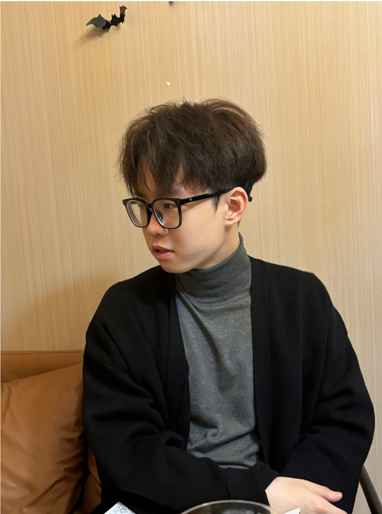

# About Me

Here is **YangChen Zeng (Merson, 曾扬晨)**.

 

I was admitted to South China Agricultural University (**华南农业大学,Guangzhou**) in 2020, majoring in Marine Biology. In 2021, I transferred to the School of Software Engineering at South China Agricultural University (Guangzhou) to study Software Engineering. I graduated from South China Agricultural University in 2024 with a Software Engineering bachelor's degree. In September 2024, I was admitted to the School of Cybersecurity at Southeast University (**东南大学,Wuxi**) to pursue a CyberSpace master's degree. 

 

My interests lie in **object detection**（目标检测） , **Multiclasses Object track**  （多类别目标跟踪）and **traditional computer vision  ** （传统计算机视觉）, and I hope to engage in research on multimodality（多模态） and **recommendation systems**  （推荐系统）in the future.

 

If you are interested in any aspect of me, I am always open to discussions and collaborations. Feel free to reach out to me at - **zengyangchen@foxmail.com** (with your purpose please)

---

## Research Interests

[**I am currently working on a project to optimize multimodal small object detection. **](https://github.com/yidimopozhibai/owesome_thiny_detection_in_RIs)

- recommendation systems
- object detection
- Multiclasses track
- traditional computer vision(OpenCV etc.)

---

## News and Updates

- [2024年11月**全国仿真创新应用大赛智能装备仿真赛道**-**智能硬件仿真**国家一等奖（全国第一名）](http://www.siac.net.cn/h-nd-206.html)[**公示中**]
  - [《以摄像机为主导的低功耗芯片无人智能车》项目将开源至Github](https://github.com/orgs/SCAU-RM%EF%BF%BENAV/repositories)
  - 2024年10月**全国仿真创新应用大赛智能装备仿真赛道**省级一等奖，入围决赛
- **2024年9月入学东南大学 攻读硕士学位**
- 2021至2024年参加ShuQin,Tu老师课题组有如下产出
  - [《**基于改进ByteTrack算法的群养生猪行为识别与跟踪技术**》(《农业机械学报》2022,53-12)](https://kns.cnki.net/kcms2/article/abstract?v=Oa1N_PzK0nRoyrtqD5Feb9I8128LHHnL7RhfhQCba6Y9fPHhJFSXuGL_veRI5dYBNkF-2IquHwRYKRC4g86xGYQmIGc6m6fv9ajWYKvfnISSZ0mNyGb9_lfpAnXWfg1cRUtgYjl1NzE38ksDfkKTeufRnDSC_tN4YCA5JxUCXqW62BGInzpMfAtnayjnqrqx&uniplatform=NZKPT&language=CHS)
  - [《一种群养生猪多目标跟踪及行为统计方法》（发明专利申请号：202211386127.2）](https://kns.cnki.net/kcms2/article/abstract?v=Oa1N_PzK0nSFiNi09Jy2D1CUcbaKQtBcATJJPw3cU2YLHgUndVtL4-0IJwIxQcaOKl5utKVvtfq_nz276e2dqC0j8QjPb23aMxjebgKUrMD3qPunm3mcOReudfeJqbmuhTfL3sokq3-9N2PS_3vBHDEdDpe7iHls2kzQt8KAgUhxTLA54D_llh3lRI6s5qCc&uniplatform=NZKPT&language=CHS)
- 2020至2023年参加**全国大学生机器人竞赛**获得省部级以上奖项共10项，分别如下：
  - **2023第二十二届全国大学生机器人大赛超级对抗赛 国家级一等奖（殿军）；**
  - 2023第二十二届全国大学生机器人大赛南部赛区一等奖；
  - 2023第二十二届全国大学生机器人大赛广东高校联盟赛3V3对抗赛一等奖；
  - **2022第二十一届全国大学生机器人大赛超级对抗赛 国家级一等奖；**
  - 2022第二十一届全国大学生机器人大赛南部赛区一等奖；
  - 2022第二十一届全国大学生机器人大赛广东高校联盟赛步兵对抗赛一等奖；
  - RoboMaster 2022机甲大师高校单项步兵竟速与智能射击 **国家级二等奖**；
  - RoboMaster 2023机甲大师高校联盟赛3V3对抗赛哨兵机器人 团队一等奖；
  - RoboMaster 2022机甲大师全国对抗赛英雄组 团队三等奖；
  - RoboMaster 2022机甲大师广东高校联盟赛步兵 团队三等奖；
- 2022第十七届全国大学生智能汽车竞赛全国总决赛 **国家级二等奖**；
- 2022第十七届全国大学生智能汽车竞赛南区省部级一等奖（**第二名**）；
- 2021全国大学生数学建模竞赛广东赛区二等奖；
- 2021亚太地区大学生数学建模竞赛二等奖；
- 2022年美国大学生数学建模 **国际二等奖**；
- 2022年数维杯大学生数学建模竞赛本科组二等奖；
- 2021全国大学生英语作文大赛省级三等奖；
- 2020全国大学生英语翻译大赛省级三等奖；
- 2022第三届“航天杯”移动机器人AI创新技术挑战赛二等奖；
- 2022（第15届）中国大学生计算机设计大赛人工智能挑战赛省级三等奖；
- **2020年9月入学华南农业大学 攻读学士学位**

---

## My internship

- 2020.12～至今          华南农业大学    校机器人战队队员   **视觉算法组组长**；
- 2021.04～至今          参加华南农业大学实验室科研及创新创业基金项目，发表1篇论文；
- 2022.07深圳大疆创新科技  实习  车载计算机视觉、测试代码；
- 2023.06东软教育科技集团  实习  前端开发、后端开发；
- 2023.07深圳大疆创新科技  实习  车载计算机视觉、测试代码；
- 2024.04～至今          参加东南大学实验室科研;

